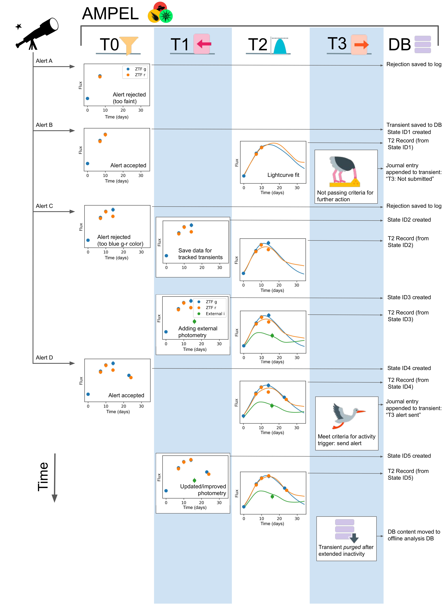

# Ampel-contrib-sample

AMPEL is a modular software framework designed for the analysis of streamed data. This repository contains sample code based on which AMPEL modules can be tested and created offline. These can thereafter be merged into a live instance and applied to a live stream of data.

## Introduction

The basic concepts and several useful terms are described in the overview note included in this repository (ampel_intro.pdf).

## Getting used to AMPEL tiers and modules

We have included a series of notebooks that demonstrate how Ampel works at the different internal tiers. At Tier 0 this includes a basic alert processor (broker). Each notebook includes basic examples of how a user specifies functionality through inheritance from base classes, and how these are applied to a data stream. 

Use of this sample AMPEL setup requires the Ampel-base and Ampel-base-ZTF repositories to be installed, as well as a set of common python libraries such as fastavro.

## Use of this repository to create a full AMPEL channel

Incorporating modules and channels into a live instance briefly consists of: i. Forking this repository under a name [Ampel-contrib-xyz] where xyz is a unique name ii. Add new modules to the t0/t2/t3 subdirectories. iii. Define a channel to use this using the base configuration files. iv. Use the dev alert processor and notebooks to verify expected behaviour. v. Discuss with AMPEL administrators to queue repository for inclusion into the the next build.

