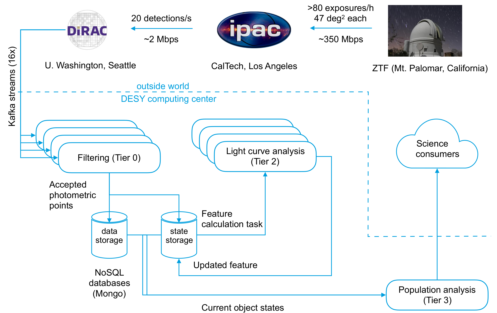

# AMPEL

Ampel is a modular software framework designed for the analysis of streamed data. AMPEL operates in four different tiers:

- T0 filters alerts from a stream
- T1 looks for new transient data to add from outside the stream
- T2 calculates/derives further properties based on the collected information
- T3 triggers reactions

Users are free to add their own operational *units*, implemented as python modules, to each tier of the live AMPEL system.  *Channels* request the use of units. This provides great power and freedom in that (almost) any combination of algorithms can be implemented and used for complete, repeatable scientific studies. However, it carries an initial cost in that units and channels have to be preconfigured. This repository contains a development version of AMPEL that allows channels and units to be developed and tested on static alert collections. Modules developed using these tools can later be merged into a full AMPEL instance where they are applied either to live alert streams or archived data. Instructions for how to install the development kit and how to design AMPEL units can be found in the [notebooks directory](notebooks/) of this repository. The rest of this README contains a general introduction to the AMPEL system.

The live AMPEL instance functions as a public broker for use with the ZTF alert stream. High quality, potential extragalactic supernovae are submitted to the TNS in real-time. For further questions regarding how to set up an **AMPEL** channel, contact ampel-info at desy.de.

## How to use this repository

This repository cantains a set of tutorial notebooks, together with some sample units. These introduce both the process for constructing AMPEL units and channels, as well as for hosting a full local AMPEL instance. 

These install instructions assume a python 3.8 environment. A convenient way to achieve this is through conda: `conda create -n ampelTutorial python=3.8` && `conda activate ampelTutorial`. 

The following steps will install the core AMPEL modules, as well as creating a starting AMPEL configuration file. This will be used to form a `context` in the notebooks.
1. `pip install ampel-ztf` 
2. `conda install -c conda-forge sncosmo`
3. `conda install -c conda-forge iminuit` 
4. `conda install -c conda-forge jupyter` 
5. `pip install git+https://github.com/AmpelProject/Ampel-ipython.git`
6. `git clone https://github.com/AmpelProject/Ampel-contrib-sample.git`
7. `pip install --no-deps -e Ampel-contrib-sample`
8. `ampel-config build > ampel_config.yml` 

These steps will clone the `Ampel-contrib-sample` repository, and create a `ampel_config.yml` context file. If the last step produces errors it means some setp of the analysis did not complete. Next, head to the `notebooks` subdirectory of `Ampel-contrib-sample` and look at the notebooks through executing `jupyter notebook`. 

Tutorials 2-4 use a `mongoDB` to store intermediate results (as in a full install), which needs to be separately installed and started. Edit the `ampel_config.yml` file in case it should connect through a non-standard port.

### Creating your AMPEL repository

The first step for developing an AMPEL science program is to make a repository, using this as a template. Replace `sample` with a suitable group identifier. 

### AMPEL unit files

Units that are to be run through AMPEL are included in the correct folder of the [ampel/contrib/sample/](ampel/contrib/sample/) as python modules inheriting from an appropriate abstract class. This ensures that they can be incorporated into a live AMPEL instance processing real-time or archive data. 

### Configuration files

The `conf` directory contains a set of different configuration files: `units.yaml` lists new units added in this repository, the `channel` subdirectory contains configuration for specific channels and the `process` subdirectory lists distinct processes together with their scheduling criteria. A channel configuration can list processes, while operations that join transients from multiple channels have to list these as a separate process.

## Motivation

Both multi-messenger astronomy and new high-throughput wide-field surveys require the development of flexible tools for the selection and analysis of astrophysical transients. The Alert Management, Photometry and Evaluation of Lightcurves (AMPEL) system is a streaming data analysis framework. As such it functions to accept, process and react to streams of transient data. AMPEL contains a broker as the first of four pipeline levels, or 'tiers', where each can incoroporate user-contributed analysis units. These tools are embedded into a framework that encourages provenance and keeps track of the varying information states that a transient displays. The latter concept includes information gathered over time, but also tracks varying data access levels and e.g. improved calibration. AMPEL provides a tool that can assist in filtering transients in real time, running realistic alert reaction simulations, reprocessing of full datasets as well as the final scientific analysis of transient data.

AMPEL differs from traditional brokers in the focus on the full analysis chain of streamed data. As a consequence, there is no (subselected) collection to be queried after alerts have been received. AMPEL users are pro-active in designing channels which are merged into the live instance and exposed to the full stream. This provides full flexibility in analysis design, provenance and what reactions are possible.

## AMPEL in a nutshell

The core object in AMPEL is a *transient*, a single object identified by a creation date and typically a region of origin in the sky. Each transient is linked to a set of *datapoints* that represent individual measurements. Datapoints can be added, updated, marked as bad, or replaced, but never removed. Each datapoint can be associated with tags indicating e.g. any masking or proprietary restrictions. Transients and datapoints are connected by *states*, where a state references a *compound* of datapoints. A state represents a view of a transient available at some time and for some observer. For an optical photometric survey, a compound can be directly interpreted as a set of flux measurements or a lightcurve.

> Example: A ZTF alert corresponds to a potential transient. Datapoints here are simply the photometric magnitudes reported by ZTF. When first inserted, a transient has a single state with a compound consisting of the datapoints in the initial alert. If this transient is detected again, the new datapoint is added to the collection and a new state created containing both previous and new data. Should the first datapoint be public but the second datapoint be private, only users with proper access will see the updated state.

Using AMPEL means creating a *channel*, corresponding to a specific science goal, which prescribes behavior at four different stages, or *tiers*. What tasks should be performed at what tier can be determined by answers to the questions: *Tier 0: What are the minimal requirements for an alert to be interesting?*, *Tier 1:  Can datapoints be changed by events external to the stream?*, *Tier 2:  What calculations should be done on each of the candidates states?*, *Tier 3: What operations should be done at timed intervals?*

In Tier 0 (T0), the full alert stream is *filtered* to only include potentially interesting candidates. This tier thus works as a data broker: objects that merit further study are selected from the incoming alert stream. However, unlike most brokers, accepted transients are inserted into a database (DB) of active transients rather than immediately being sent downstream. Users can either provide their own algorithm for filtering, or configure one of the filter classes provided by the community, according to their needs.

> Example T0: The simple AMPEL channel `BrightNStable` looks for variables with at least three well behaved detections (few bad pixels and reasonable subtraction FWHM) and not coincident with a Gaia DR2 star-like source. This is implemented through a python class SampleFilter that operates on an alert and returns either a list of requests for follow-up (T2) analysis, if selection criteria are fulfilled, or `False` if they are not. AMPEL will test every ZTF alert using this class, and all alerts that pass the cut are added to the active transient DB. The transient is then associated with the channel ``BrightNStable''.

Tier 1 (T1) is largely autonomous and exists in parallel to the other tiers. T1 carries out duties related to *updates* of datapoints and states. Example activities include completing transient states with datapoints that were present in new alerts but where these were not individually accepted by the channel filter (e.g., in the case of lower significance detections at late phases), as well as querying an external archive for updated calibration or adding photometry from additional sources.

Additional transient information is derived or retrieved in Tier 2 (T2), and are always connected to a state and stored as a *ScienceRecord*. T2 units either work with the empty state, relevant for e.g. catalog matching that only depends on the position, or depends on the datapoints of a state to calculate new, derived transient properties. In the latter case, the T2 task will be called again as soon as a new state is created.  This could be due both to new observations or, for example, updated calibration of old datapoints. Possible T2 units include lightcurve fitting, photometric redshift estimation, machine learning classification, and catalog matching.

> Example T2: For an optical transient, a state corresponds to a lightcurve and each photometric observation is represented by a datapoint. A new observation of the transient would extend the lightcurve and thus create a new state. `BrightNStable` requests a third order polynomial fit  for each state  using the `T2PolyFit` class. The outcome, in this case polynomial coefficients, are saved to the database.

The final AMPEL level, Tier 3 (T3), consists of *schedulable* actions. While T2s are initiated by events (the addition of new states), T3 units are executed at pre-determined times. These can range from yearly data dumps, to daily updates, to effectively real-time execution every few seconds. T3 processes access data through the *TransientView*, which concatenates all  information regarding a transient. This includes both states and ScienceRecords that are accessible by the channel. T3s iterate through all transients of a channel. This allows for an evaluation of multiple ScienceRecords, and comparisons between different objects or, more generally, any kind of population analysis. One typical case is the ranking of candidates which would be interesting to observe on a given night.  T3 units include options to push and pull information from for example Slack, TNS and web-servers.

> Example T3: The science goal of ``BrightNStable'' is to observe transients with a steady rise. At the T3 stage the channel therefore loops through the TransientViews, and examines all T2PolyFit science records for fit parameters which indicate a lasting linear rise. Any transients fulfilling the final criteria trigger an immediate notification sent to the user. This test is scheduled to be performed at 13:15 UT each day.

## Life of a transient in AMPEL

*Life of a transient in AMPEL.* Sample behavior at the four tiers of \am as well as the database access are shown as columns, with the left side of the figure indicating when the four alerts belonging to the transient were received.
1. T0: The first alert is rejected, while the following two pass the channel acceptance criteria. The final alert is, again, rejected as the transient is now too faint.
2. T1: First, a measurement provided by a secondary facility is ingested. Second, new observations of channel transients are added even if alerts in isolation would not be accepted. Third, updated calibration of a measurement causes this datapoint to be replaced.
3. T2: Every time a new state is created a lightcurve fit is performed and the fit results stored as a Science Records.
4. T3: A unit regularly tests whether the transient warrants a Slack posting (requesting potential further follow-up). The submit criteria are fulfilled the second time the unit is run. In both cases the evaluation is stored in the transient \emph{Journal}, which is later used to prevent a transient to be posted multiple times. Once the transient has not been updated for an extended time a T3 unit \emph{purges} the transient to an external database that can be directly queried by channel owners.
5. Database: A transient entry is created in the DB as the first alert is accepted. After this, each new datapoint causes a new state to be created. T2 Science Records are each associated with one state. The T3 units return information that is stored in the Journal.

A technical outline of AMPEL can be found [here](figures/ZTF_Pipeline_overview_June_18.pdf).

## The AMPEL live instance: parsing the ZTF alert stream and submitting candidates to TNS

An instance of AMPEL hosted at the DESY computer centre (Zeuthen) recieves and parses the live ZTF alert stream distributed by the University of Washingtion. This process is summarized in the following figure:

